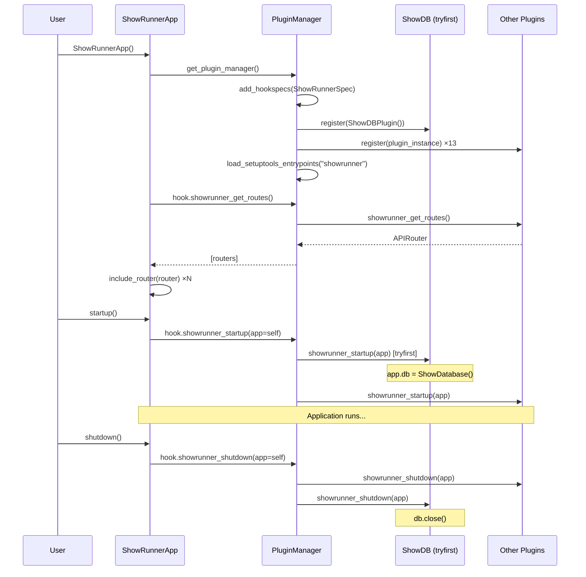

# Plugin Architecture

## Overview

ShowRunner uses [pluggy](https://pluggy.readthedocs.io/) to implement a plugin-based architecture where each tool (ShowScripter, ShowMixer, etc.) is a self-contained plugin that registers with the core application through a well-defined set of hooks.

```mermaid
graph TB
    subgraph Core ["ShowRunner Core"]
        APP[ShowRunnerApp]
        PM[PluginManager<br/><i>pluggy</i>]
        SPECS[ShowRunnerSpec<br/><i>hookspecs</i>]
        API[FastAPI App]
    end

    APP --> PM
    APP --> API
    PM --> SPECS

    subgraph Hooks ["Hook Specifications"]
        H1["showrunner_register()"]
        H2["showrunner_startup(app)"]
        H3["showrunner_shutdown(app)"]
        H4["showrunner_get_routes()"]
        H5["showrunner_get_commands()"]
        H6["showrunner_command(name)"]
        H7["showrunner_query(name)"]
        H8["showrunner_event(name)"]
    end

    SPECS --> H1
    SPECS --> H2
    SPECS --> H3
    SPECS --> H4
    SPECS --> H5
    SPECS --> H6
    SPECS --> H7
    SPECS --> H8

    subgraph Plugins ["Built-in Plugins"]
        P1[ShowScripter<br/>/script ‹NiceGUI›]
        P2[ShowDesigner<br/>/designer]
        P3[ShowProgrammer<br/>/programmer]
        P4[ShowMixer<br/>/mixer]
        P5[ShowLighter<br/>/lighter]
        P6[ShowManager<br/>/manager]
        P7[ShowStopper<br/>/stopper]
        P8[ShowPrompter<br/>/prompter]
        P9[ShowComms<br/>/comms]
        P10[ShowCmd<br/>/cmd]
        P11[ShowRecorder<br/>/recorder]
        P12[ShowDB<br/>SQLite backend]
        P13[ShowAdmin<br/>/admin ‹optional›]
        P14[ShowDashboard<br/>/ ‹NiceGUI›]
    end

    PM --> P1
    PM --> P2
    PM --> P3
    PM --> P4
    PM --> P5
    PM --> P6
    PM --> P7
    PM --> P8
    PM --> P9
    PM --> P10
    PM --> P11
    PM --> P12
    PM --> P13
    PM --> P14

    EXT[External Plugins<br/><i>setuptools entry points</i>]
    PM -.->|"load_setuptools_entrypoints<br/>('showrunner')"| EXT

    H4 -->|"APIRouter"| API

    style Core fill:#1a1a2e,stroke:#e94560,color:#eee
    style Hooks fill:#16213e,stroke:#0f3460,color:#eee
    style Plugins fill:#0f3460,stroke:#533483,color:#eee
    style EXT fill:#533483,stroke:#e94560,color:#eee
```



## Hook Specifications

All hooks are defined in `src/showrunner/hookspecs.py` and prefixed with `showrunner_`.

| Hook                                 | Purpose                             | Returns                            | Status                          |
| ------------------------------------ | ----------------------------------- | ---------------------------------- | ------------------------------- |
| `showrunner_register()`              | Report plugin metadata              | `dict(name, description, version)` | ✅ All plugins                  |
| `showrunner_startup(app)`            | Initialize resources at app startup | —                                  | ✅ All plugins                  |
| `showrunner_shutdown(app)`           | Release resources at app shutdown   | —                                  | ✅ All plugins                  |
| `showrunner_get_routes()`            | Provide HTTP endpoints              | `fastapi.APIRouter` or `None`      | ✅ All plugins                  |
| `showrunner_get_commands()`          | Provide CLI/TUI commands            | `list[dict]`                       | ✅ All plugins                  |
| `showrunner_command(name, **kwargs)` | Receive a broadcast command         | —                                  | 🔲 Defined, not yet implemented |
| `showrunner_query(name, **kwargs)`   | Answer a broadcast query            | any                                | 🔲 Defined, not yet implemented |
| `showrunner_event(name, **kwargs)`   | Receive a broadcast event           | —                                  | 🔲 Defined, not yet implemented |
| `showrunner_subscribe(name)`         | Subscribe to a named event stream   | —                                  | 🔲 Defined, not yet implemented |

> **Future hooks** (`showrunner_command`, `showrunner_query`, `showrunner_event`, `showrunner_subscribe`) are registered in the hook spec but no built-in plugin implements them yet. They are reserved for the inter-plugin messaging system.

## Plugin Startup Ordering

pluggy supports `tryfirst=True` and `trylast=True` on individual hook implementations to control call order. ShowRunner uses this for two plugins:

| Plugin          | Hook                 | Order      | Reason                                                  |
| --------------- | -------------------- | ---------- | ------------------------------------------------------- |
| `ShowDB`        | `showrunner_startup` | `tryfirst` | Must open the database before any other plugin needs it |
| `ShowAdmin`     | `showrunner_startup` | `trylast`  | Must mount admin views after the DB engine is available |
| `ShowDashboard` | `showrunner_startup` | `trylast`  | Must build NiceGUI pages after the DB is ready          |

## Shared Application State (`app.db`)

`ShowDB.showrunner_startup` sets `app.db` to the live `ShowDatabase` instance:

```python
# In ShowDBPlugin.showrunner_startup (tryfirst=True):
app.db = ShowDatabase()
app.db.create_schema()
```

Any plugin that needs database access in its `showrunner_startup` hook can read `app.db`:

```python
@showrunner.hookimpl
def showrunner_startup(self, app):
    db = getattr(app, 'db', None)   # None if ShowDB is not loaded
    if db is None:
        return
    # use db normally
```

> `app.db` is only guaranteed to exist after `ShowDB.showrunner_startup` has run (i.e. during `startup()` and beyond — not during `__init__`).

## Optional Dependency Groups

| Group    | Package                              | Enables                                  |
| -------- | ------------------------------------ | ---------------------------------------- |
| _(core)_ | `nicegui`                            | `ShowDashboard`, `ShowScripter` UI pages |
| `admin`  | `sqladmin`, `wtforms`                | `ShowAdmin` panel at `/admin`            |
| `dev`    | `uvicorn`, `pytest`, `ruff`, `black` | Dev server and tooling                   |

Install with `uv sync --group <name>` or `uv sync --all-groups`.

## Deployment Note

`ShowRunner.startup()` is called **manually** by the CLI (`sr start`) and the `scripts/dev` helper. It is **not** wired to FastAPI's ASGI lifespan events. This means:

- Passing `ShowRunner().api` to a plain ASGI server (e.g. `gunicorn`) without calling `startup()` will leave `app.db` unset and all database-backed routes will crash.
- Hot-reload (`uvicorn --reload`) is not compatible with `sr start` because reload requires an import string, not a live app object. Use `scripts/dev` directly or call uvicorn manually for development.

A future improvement would wire `startup()`/`shutdown()` into FastAPI's [`lifespan` context manager](https://fastapi.tiangolo.com/advanced/events/).

## Plugin Lifecycle



## Project Layout

```
src/showrunner/
├── __init__.py          # Public API: hookimpl marker, ShowRunner class
├── hookspecs.py         # Hook specifications (the plugin contract)
├── app.py               # Core: PluginManager + FastAPI wiring
├── database.py          # ShowDatabase – SQLite engine/session manager
├── models.py            # SQLModel ORM models (Show, Script, Cue, …)
└── plugins/
    ├── __init__.py      # Built-in plugin registry
    ├── db.py            # ShowDB        – SQLite backend, /db/* REST routes
    ├── dashboard.py     # ShowDashboard – / dashboard (NiceGUI)
    ├── scripter.py      # ShowScripter  – /script viewer (NiceGUI)
    ├── admin.py         # ShowAdmin     – /admin panel (sqladmin, optional)
    ├── designer.py      # ShowDesigner  – /designer
    ├── programmer.py    # ShowProgrammer – /programmer
    ├── mixer.py         # ShowMixer     – /mixer
    ├── lighter.py       # ShowLighter   – /lighter
    ├── stage_manager.py # ShowManager   – /manager
    ├── stopper.py       # ShowStopper   – /stopper
    ├── prompter.py      # ShowPrompter  – /prompter
    ├── comms.py         # ShowComms     – /comms
    ├── cmd.py           # ShowCmd       – /cmd
    └── recorder.py      # ShowRecorder  – /recorder
```

## Writing an External Plugin

Third-party plugins are discovered via **setuptools entry points**. Create a package with a `pyproject.toml`:

```toml
[project]
name = "showrunner-myplugin"
dependencies = ["showrunner"]

[project.entry-points.showrunner]
myplugin = "showrunner_myplugin:MyPlugin"
```

Then implement the hooks you need using the `@showrunner.hookimpl` decorator:

```python
import showrunner
from fastapi import APIRouter

router = APIRouter(prefix="/myplugin", tags=["MyPlugin"])

@router.get("/")
async def index():
    return {"plugin": "MyPlugin", "status": "ok"}


class MyPlugin:
    @showrunner.hookimpl
    def showrunner_register(self):
        return {"name": "MyPlugin", "description": "...", "version": "0.1.0"}

    @showrunner.hookimpl
    def showrunner_get_routes(self):
        return router

    @showrunner.hookimpl
    def showrunner_startup(self, app):
        # app.db is available here if ShowDB is loaded
        pass
```

Install the package alongside ShowRunner and it will be automatically discovered on the next `sr start`.
