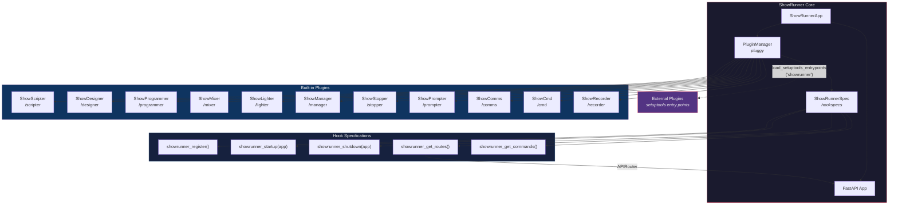
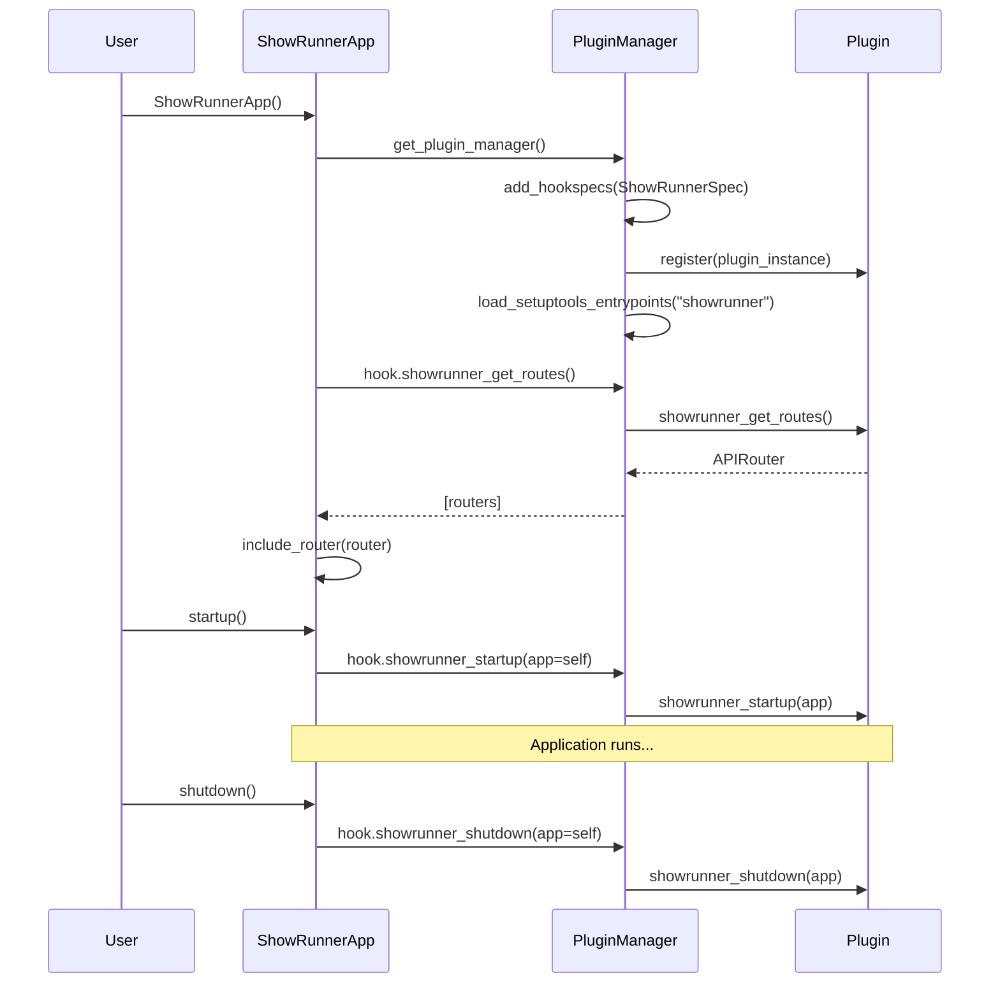

# ShowRunner Plugin Architecture

## Overview

ShowRunner uses [pluggy](https://pluggy.readthedocs.io/) to implement a plugin-based architecture where each tool (ShowScripter, ShowMixer, etc.) is a self-contained plugin that registers with the core application through a well-defined set of hooks.



## Hook Specifications

All hooks are defined in `src/showrunner/hookspecs.py` and prefixed with `showrunner_`.

| Hook                        | Purpose                             | Returns                                      |
| --------------------------- | ----------------------------------- | -------------------------------------------- |
| `showrunner_register()`     | Report plugin metadata              | `dict` with `name`, `description`, `version` |
| `showrunner_startup(app)`   | Initialize resources at app startup | —                                            |
| `showrunner_shutdown(app)`  | Release resources at app shutdown   | —                                            |
| `showrunner_get_routes()`   | Provide HTTP endpoints              | `fastapi.APIRouter` or `None`                |
| `showrunner_get_commands()` | Provide CLI/TUI commands            | `list[dict]`                                 |

## Plugin Lifecycle



## Project Layout

```
src/showrunner/
├── __init__.py          # Public API: hookimpl marker, ShowRunnerApp
├── hookspecs.py         # Hook specifications (the plugin contract)
├── app.py               # Core app: PluginManager + FastAPI wiring
└── plugins/
    ├── __init__.py      # Built-in plugin discovery
    ├── scripter.py      # ShowScripter  - /scripter
    ├── designer.py      # ShowDesigner  - /designer
    ├── programmer.py    # ShowProgrammer - /programmer
    ├── mixer.py         # ShowMixer     - /mixer
    ├── lighter.py       # ShowLighter   - /lighter
    ├── stage_manager.py # ShowManager   - /manager
    ├── stopper.py       # ShowStopper   - /stopper
    ├── prompter.py      # ShowPrompter  - /prompter
    ├── comms.py         # ShowComms     - /comms
    ├── cmd.py           # ShowCmd       - /cmd
    └── recorder.py      # ShowRecorder  - /recorder
```

## Writing an External Plugin

Third-party plugins are discovered via **setuptools entry points**. Create a package with a `pyproject.toml`:

```toml
[project]
name = "showrunner-myplugin"
dependencies = ["showrunner"]

[project.entry-points.showrunner]
myplugin = "showrunner_myplugin"
```

Then implement the hooks using the `@showrunner.hookimpl` decorator:

```python
import showrunner
from fastapi import APIRouter

router = APIRouter(prefix="/myplugin", tags=["MyPlugin"])

@router.get("/")
async def index():
    return {"plugin": "MyPlugin"}

class MyPlugin:
    @showrunner.hookimpl
    def showrunner_register(self):
        return {"name": "MyPlugin", "description": "...", "version": "0.1.0"}

    @showrunner.hookimpl
    def showrunner_get_routes(self):
        return router
```

Install the package alongside ShowRunner and it will be automatically discovered.
